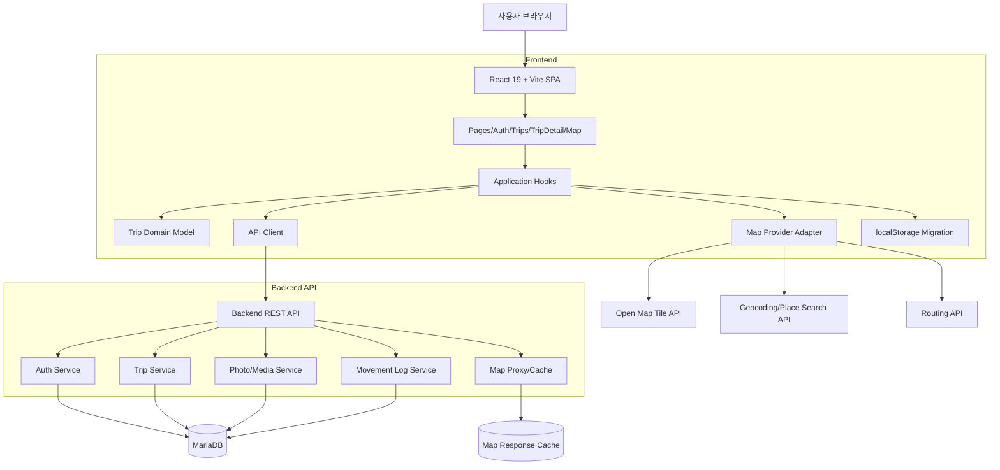
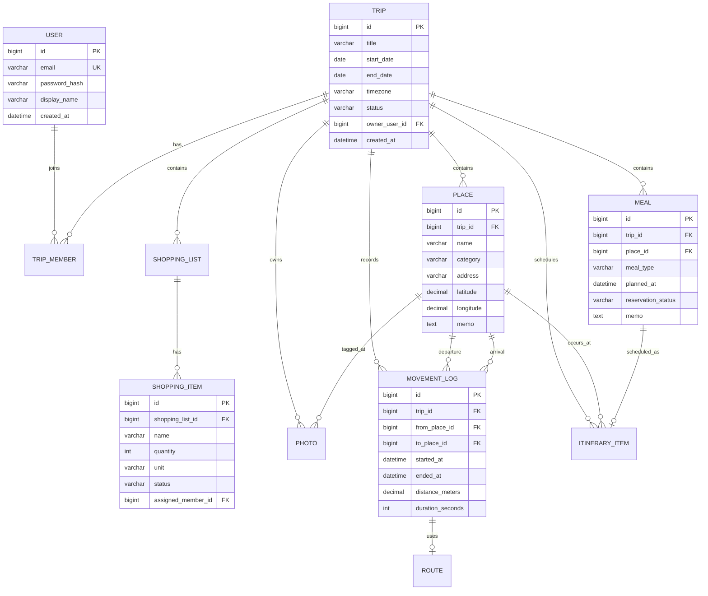
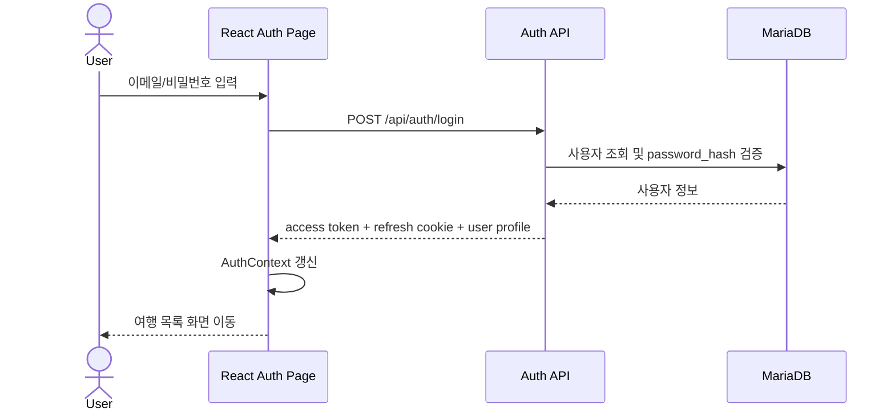
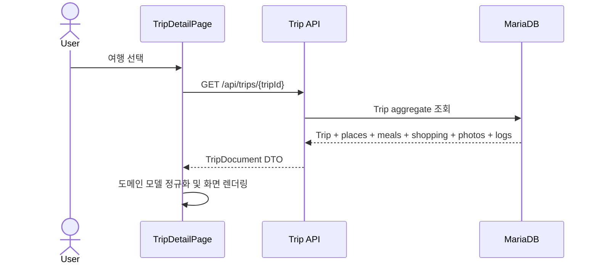
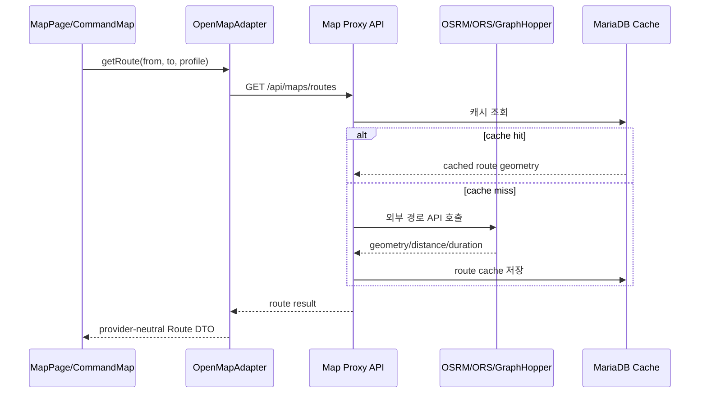
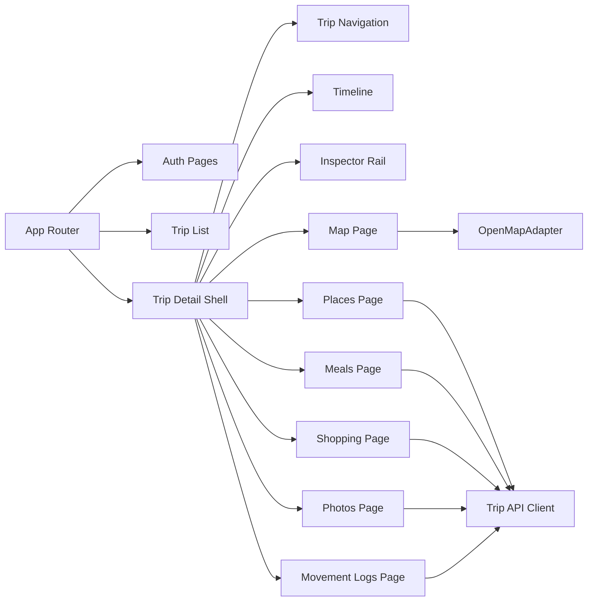

# 기본 설계서: Family Trip Command Center 고도화

## 1. 문서 목적

현재 React 19 + Vite 단일 프론트엔드 앱을 다음 목표로 확장하기 위한 기본 아키텍처와 도메인 설계를 정의한다.

- Google Maps JS API 의존 제거 및 Open Map API 기반 지도/경로 기능 전환
- 인증 페이지 및 사용자 세션 설계
- localStorage 기반 trip document를 MariaDB 영속 저장소 기반 구조로 전환
- `여행(Trip)` 단위를 중심으로 방문 장소, 식사 장소, 쇼핑리스트, 사진, 이동로그를 저장/조회
- 향후 백엔드 API 도입을 전제로 프론트엔드 모듈 분리와 데이터 계약 정의

---

## 2. 기본 설계서 권장 목차

1. 개요
   - 목적 / 범위 / 비범위
   - 현행 시스템 요약
   - 목표 시스템 요약
2. 요구사항 정리
   - 기능 요구사항
   - 비기능 요구사항
   - 제약사항 및 가정
3. 목표 아키텍처
   - 전체 시스템 구성
   - 프론트엔드 레이어 구조
   - 백엔드/API 레이어 구조
   - MariaDB 데이터 저장 구조
   - 외부 Open Map 연동 구조
4. 핵심 도메인 모델
   - 엔티티 목록
   - 엔티티 관계
   - 상태값/타입 정의
5. 데이터 흐름
   - 로그인/세션 흐름
   - 여행 목록/상세 조회 흐름
   - 장소/식사/쇼핑/사진/이동로그 저장 흐름
   - 지도 타일/검색/경로 조회 흐름
6. API 설계 원칙
   - REST 리소스 규칙
   - 인증/인가 방식
   - 오류 응답 규격
   - 페이지네이션/정렬/검색 규칙
7. 프론트엔드 설계 원칙
   - 라우팅
   - 상태 관리
   - API 클라이언트
   - 지도 어댑터
   - localStorage 마이그레이션
8. 보안/개인정보 설계
   - 인증정보 저장
   - 사진/위치정보 접근 제어
   - 지도 API 키/토큰 관리
9. 배포/환경 구성
   - 환경변수
   - 개발/운영 환경 차이
   - DB 마이그레이션 전략
10. Mermaid 다이어그램 목록
11. 리스크 및 오픈 이슈

---

## 3. 현행 시스템 요약

- 프론트엔드: React 19 + Vite SPA
- 주요 파일
  - `src/App.jsx`: 메인 화면, 페이지 전환, 타임라인/오버레이 로직
  - `src/CommandMap.jsx`: Google Maps 로딩, 지도 렌더링, 경로/마커/재생 로직
  - `src/tripModel.js`: seeded trip document, collection helper, local document projection
  - `src/usePersistedTripState.js`: localStorage 저장/복원
- 데이터 저장: 브라우저 localStorage
- 지도: `@googlemaps/js-api-loader`, Google Maps JS API, Google 지도 링크
- 현재 도메인: families, locations, routes, itineraryItems, meals, activities, stayItems, expenses, tasks 중심

---

## 4. 목표 시스템 아키텍처

### 4.1 아키텍처 방향

현재 SPA 내부에 집중된 데이터/지도/상태 로직을 다음 레이어로 분리한다.

- Presentation Layer: React 페이지/컴포넌트
- Application Layer: use cases, 화면별 orchestration hooks
- Domain Layer: Trip 중심 도메인 타입과 규칙
- Infrastructure Layer: API client, map provider adapter, storage migration
- Backend API Layer: 인증, Trip CRUD, 사진 메타데이터, 이동로그, 지도 연동 프록시
- Database Layer: MariaDB
- External Map Layer: OpenStreetMap 계열 타일/검색/경로 서비스

### 4.2 Open Map API 선택 가정

기본 설계에서는 벤더 종속을 줄이기 위해 `MapProviderAdapter`를 둔다.

권장 조합:

- 지도 렌더링: Leaflet 또는 MapLibre GL JS
- 타일: OpenStreetMap-compatible tile server
- 지오코딩/장소 검색: Nominatim 또는 Pelias
- 경로 탐색: OSRM 또는 GraphHopper 또는 OpenRouteService
- 링크 아웃: Google Maps 링크 대신 OSM URL 또는 provider-neutral URL builder 사용

> 설계 문서에서는 특정 무료 공개 API에 운영 트래픽을 직접 의존하지 않도록 rate limit, 캐싱, 서버 프록시를 명시한다.

---

## 5. 전체 시스템 구성도



---

## 6. 프론트엔드 모듈 분해

```text
src/
  app/
    router.jsx                 # 인증/여행 목록/여행 상세 라우팅
    providers.jsx              # AuthProvider, QueryProvider 등 전역 Provider
  pages/
    auth/
      LoginPage.jsx
      RegisterPage.jsx
    trips/
      TripListPage.jsx
      TripCreatePage.jsx
      TripDetailPage.jsx
    trip-detail/
      ItineraryPage.jsx
      PlacesPage.jsx
      MealsPage.jsx
      ShoppingPage.jsx
      PhotosPage.jsx
      MovementLogPage.jsx
      MapPage.jsx
  features/
    auth/
      authApi.js
      useAuth.js
      authTypes.js
    trips/
      tripApi.js
      tripTypes.js
      useTripDocument.js
    places/
      placeApi.js
      placeTypes.js
    meals/
      mealApi.js
      mealTypes.js
    shopping/
      shoppingApi.js
      shoppingTypes.js
    photos/
      photoApi.js
      photoTypes.js
    movement-logs/
      movementLogApi.js
      movementLogTypes.js
    maps/
      mapProviderAdapter.js
      openMapAdapter.js
      routeService.js
      geocodeService.js
  shared/
    api/httpClient.js
    domain/ids.js
    domain/dateTime.js
    components/
```

현재 `src/tripModel.js`, `src/CommandMap.jsx`, `src/App.jsx`에 있는 로직은 위 구조로 점진 분리한다.

---

## 7. 핵심 도메인 모델

### 7.1 엔티티 개요

| 엔티티 | 설명 | 주요 관계 |
|---|---|---|
| User | 로그인 사용자 | TripMember, Photo, MovementLog 생성자 |
| Trip | 여행 단위 루트 aggregate | Places, Meals, ShoppingLists, Photos, MovementLogs 포함 |
| TripMember | 여행 참여자/가족/그룹 | User 또는 외부 참여자와 연결 |
| Place | 방문 장소/숙소/관광지/물류 지점 | Trip, Photos, ItineraryItems, MovementLogs와 연결 |
| Meal | 식사 계획/방문 식당 | Place 선택 연결 가능 |
| ShoppingList | 여행별 쇼핑리스트 | ShoppingItem 포함 |
| ShoppingItem | 구매 항목 | 담당자, 상태, 수량 |
| Photo | 여행/장소/로그에 연결되는 사진 메타데이터 | 파일 저장소 URL 또는 외부 URL |
| MovementLog | 이동 기록 | 출발/도착 Place, 경로 좌표, 시간 |
| ItineraryItem | 일정 항목 | Place/Meal/MovementLog와 연결 가능 |
| Route | 지도 경로 결과 캐시 | MovementLog 또는 ItineraryItem에 연결 |
| Attachment | 사진 외 파일 첨부 확장용 | Trip 또는 entity 연결 |

### 7.2 ERD



---

## 8. 주요 상태/타입 정의

### 8.1 TripStatus

- `draft`: 계획 작성 중
- `active`: 여행 진행 중
- `completed`: 여행 종료
- `archived`: 보관됨

### 8.2 PlaceCategory

- `stay`: 숙소
- `visit`: 방문지/관광지
- `meal`: 식사 장소
- `shopping`: 장보기 장소
- `logistics`: 휴게소/주차장/집결지
- `custom`: 사용자 정의

### 8.3 ShoppingItemStatus

- `todo`: 구매 필요
- `assigned`: 담당자 지정
- `bought`: 구매 완료
- `cancelled`: 취소

### 8.4 MovementLogType

- `planned`: 계획된 이동
- `actual`: 실제 이동 기록
- `manual`: 수동 입력
- `imported`: 외부 데이터 import

---

## 9. API 리소스 설계 원칙

### 9.1 인증

```text
POST /api/auth/register
POST /api/auth/login
POST /api/auth/logout
GET  /api/auth/me
POST /api/auth/refresh
```

### 9.2 여행 중심 리소스

```text
GET    /api/trips
POST   /api/trips
GET    /api/trips/{tripId}
PATCH  /api/trips/{tripId}
DELETE /api/trips/{tripId}

GET    /api/trips/{tripId}/members
POST   /api/trips/{tripId}/members

GET    /api/trips/{tripId}/places
POST   /api/trips/{tripId}/places
PATCH  /api/trips/{tripId}/places/{placeId}
DELETE /api/trips/{tripId}/places/{placeId}

GET    /api/trips/{tripId}/meals
POST   /api/trips/{tripId}/meals
PATCH  /api/trips/{tripId}/meals/{mealId}
DELETE /api/trips/{tripId}/meals/{mealId}

GET    /api/trips/{tripId}/shopping-lists
POST   /api/trips/{tripId}/shopping-lists
POST   /api/trips/{tripId}/shopping-lists/{listId}/items
PATCH  /api/trips/{tripId}/shopping-lists/{listId}/items/{itemId}

GET    /api/trips/{tripId}/photos
POST   /api/trips/{tripId}/photos
DELETE /api/trips/{tripId}/photos/{photoId}

GET    /api/trips/{tripId}/movement-logs
POST   /api/trips/{tripId}/movement-logs
PATCH  /api/trips/{tripId}/movement-logs/{logId}
DELETE /api/trips/{tripId}/movement-logs/{logId}
```

### 9.3 Open Map 프록시/어댑터 API

```text
GET /api/maps/geocode?q={query}
GET /api/maps/reverse-geocode?lat={lat}&lng={lng}
GET /api/maps/routes?from={lat,lng}&to={lat,lng}&profile=car
GET /api/maps/places/search?q={query}&near={lat,lng}
```

---

## 10. 데이터 흐름 다이어그램

### 10.1 로그인/세션



### 10.2 여행 상세 조회



### 10.3 지도 경로 조회



---

## 11. 컴포넌트 구성도



---

## 12. MariaDB 물리 설계 원칙

- 모든 테이블은 `id BIGINT AUTO_INCREMENT PRIMARY KEY` 또는 UUID 전략 중 하나로 통일한다.
- 모든 여행 하위 테이블은 `trip_id` 인덱스를 필수로 둔다.
- 위치 검색은 초기에 `latitude`, `longitude` 단순 인덱스와 bounding box 조건으로 처리한다.
- 사진 파일 자체는 DB BLOB 저장보다 Object Storage/파일 서버 저장을 권장하고, DB에는 메타데이터와 URL만 저장한다.
- 삭제 정책은 기본 soft delete(`deleted_at`)를 권장한다.
- Trip aggregate 조회 성능을 위해 `trip_id`, `planned_at`, `created_at`, `category`, `status` 인덱스를 정의한다.

---

## 13. Mermaid 다이어그램 사용 목록

| 문서 위치 | 다이어그램 종류 | 목적 |
|---|---|---|
| 기본 설계서 | `flowchart TB` | 전체 시스템 구성도 |
| 기본 설계서 | `erDiagram` | 핵심 도메인/MariaDB ERD |
| 기본 설계서 | `sequenceDiagram` | 로그인, 여행조회, 지도경로 조회 흐름 |
| 기본 설계서 | `flowchart LR` | 프론트엔드 컴포넌트 구성 |
| 기능별 상세설계서 | `stateDiagram-v2` | Trip/Shopping/Upload 상태 전이 |
| 기능별 상세설계서 | `classDiagram` | 프론트엔드 domain/service 타입 관계 |
| 기능별 상세설계서 | `journey` | 사용자 여정: 로그인→여행 생성→장소 기록 |
| 기능별 상세설계서 | `gantt` | 구현 단계/마이그레이션 일정 |

---

## 14. 리스크 및 오픈 이슈

1. OpenStreetMap 공개 타일/Nominatim 직접 사용은 운영 트래픽 제한이 크므로 캐싱 또는 상용 호스팅 검토 필요.
2. 현재 Google Maps 전용 스타일/geometry API 사용부는 Leaflet/MapLibre + turf.js 등으로 치환 설계 필요.
3. localStorage trip document와 MariaDB 정규화 모델 간 마이그레이션 규칙 필요.
4. 백엔드 기술 스택이 확정되지 않았으므로 API 계약 우선 설계 후 서버 구현 스택을 결정해야 함.
5. 사진 업로드 저장소가 미정이면 DB에는 메타데이터만 설계하고 파일 저장 전략은 별도 결정.
6. 인증 방식은 SPA 보안을 고려해 refresh token은 httpOnly cookie, access token은 메모리 보관을 기본안으로 권장.
