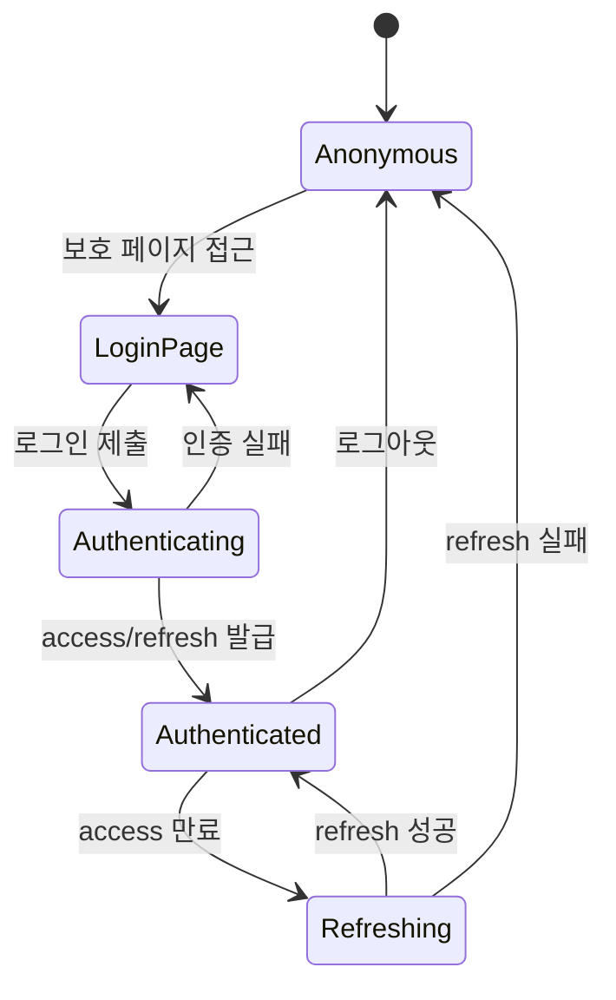
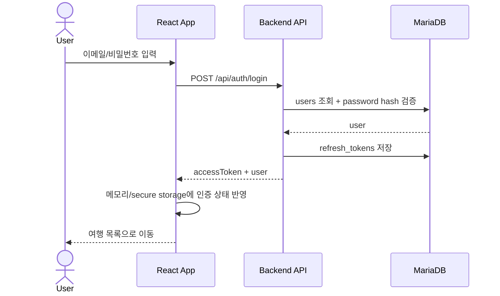

# 인증 기능 상세설계서

## 1. 목적

사용자가 이메일/비밀번호로 로그인하고, 인증된 사용자만 여행 목록과 여행 상세 데이터에 접근하도록 한다.

## 2. 범위

- 포함: 회원가입, 로그인, 로그아웃, 세션 갱신, 내 정보 조회, 보호 라우트
- 제외: OAuth, SSO, 관리자 콘솔

## 3. 화면 설계

| 화면 | 경로 | 설명 |
|---|---|---|
| 로그인 | `/login` | 이메일/비밀번호 입력, 로그인 실패 메시지 표시 |
| 회원가입 | `/register` | 이메일, 표시명, 비밀번호 등록 |
| 내 정보 | `/me` | 현재 사용자 정보 확인 |

## 4. 프론트엔드 컴포넌트

- `src/pages/LoginPage.jsx`
- `src/pages/RegisterPage.jsx`
- `src/pages/MePage.jsx`
- `src/routes/ProtectedRoute.jsx`
- `src/api/authApi.js`
- `src/hooks/useAuth.js`

## 5. API

| Method | Path | 설명 |
|---|---|---|
| POST | `/api/auth/register` | 사용자 생성 |
| POST | `/api/auth/login` | 로그인 |
| POST | `/api/auth/logout` | refresh token 폐기 |
| POST | `/api/auth/refresh` | access token 재발급 |
| GET | `/api/auth/me` | 현재 사용자 조회 |

## 6. MariaDB 테이블

```sql
CREATE TABLE users (
  id BIGINT PRIMARY KEY AUTO_INCREMENT,
  email VARCHAR(255) NOT NULL UNIQUE,
  display_name VARCHAR(100) NOT NULL,
  password_hash VARCHAR(255) NOT NULL,
  created_at DATETIME NOT NULL DEFAULT CURRENT_TIMESTAMP,
  updated_at DATETIME NOT NULL DEFAULT CURRENT_TIMESTAMP ON UPDATE CURRENT_TIMESTAMP
);

CREATE TABLE refresh_tokens (
  id BIGINT PRIMARY KEY AUTO_INCREMENT,
  user_id BIGINT NOT NULL,
  token_hash VARCHAR(255) NOT NULL UNIQUE,
  expires_at DATETIME NOT NULL,
  revoked_at DATETIME NULL,
  created_at DATETIME NOT NULL DEFAULT CURRENT_TIMESTAMP,
  CONSTRAINT fk_refresh_tokens_user FOREIGN KEY (user_id) REFERENCES users(id)
);
```

## 7. 인증 상태 흐름



## 8. 로그인 시퀀스



## 9. 검증 기준

- 비로그인 사용자는 `/trips` 접근 시 `/login`으로 이동한다.
- 로그인 성공 후 `/trips` 목록을 조회할 수 있다.
- refresh 실패 시 세션이 정리되고 로그인 화면으로 이동한다.
