# 기능별 상세설계서: Trip 중심 기능 분해

## 1. 문서 목적

본 문서는 `여행(Trip)`을 루트 도메인으로 하여 인증, 여행 관리, 장소, 식사, 쇼핑리스트, 사진, 이동로그, Open Map 전환 기능을 구현 가능한 수준으로 분해한다.

구현은 포함하지 않으며, 각 기능별 상세설계서에 들어갈 목차, 책임, 데이터 모델, API, 화면, Mermaid 다이어그램 종류를 정리한다.

---

## 2. 기능별 상세설계서 공통 목차

각 기능 문서는 아래 목차를 기본으로 작성한다.

1. 기능 개요
   - 목적
   - 사용자 시나리오
   - 포함/제외 범위
2. 화면 설계
   - 페이지 경로
   - 주요 컴포넌트
   - 입력값/검증 규칙
   - 빈 상태/오류 상태/로딩 상태
3. 도메인 모델
   - 엔티티 필드
   - 상태값
   - 연관관계
4. API 설계
   - 요청/응답 DTO
   - 오류 코드
   - 권한 규칙
5. 프론트엔드 상태 설계
   - 서버 상태
   - 클라이언트 UI 상태
   - 캐시 무효화 기준
6. 데이터베이스 설계
   - 테이블
   - 인덱스
   - 제약조건
7. Mermaid 다이어그램
   - sequenceDiagram
   - stateDiagram-v2
   - classDiagram 또는 flowchart
8. 테스트/검증 관점
9. 리스크 및 오픈 이슈

---

## 3. 기능 분해도

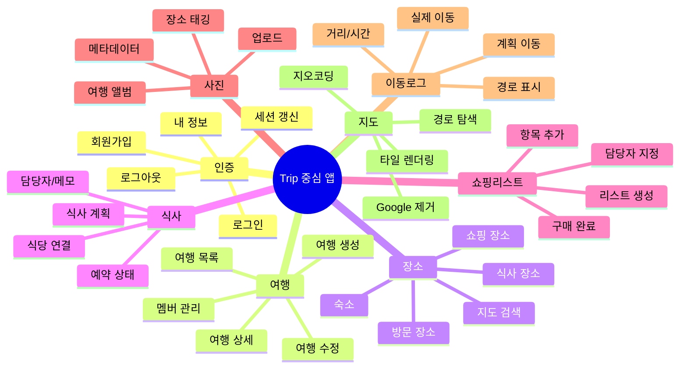

---

## 4. 인증 기능 상세설계 목차

### 4.1 요구사항

- 인증 페이지 작성: 로그인/회원가입/로그아웃/세션 유지
- 인증된 사용자만 여행 목록/상세 접근 가능
- 여행 소유자 또는 멤버만 여행 데이터 접근 가능

### 4.2 화면

| 화면 | 경로 | 설명 |
|---|---|---|
| 로그인 | `/login` | 이메일/비밀번호 로그인 |
| 회원가입 | `/register` | 신규 사용자 생성 |
| 내 정보 | `/me` 또는 헤더 메뉴 | displayName, email 표시 |

### 4.3 핵심 모델

```text
User
- id: number
- email: string
- displayName: string
- passwordHash: string
- createdAt: datetime
- updatedAt: datetime

AuthSession
- userId: number
- accessToken: string
- refreshTokenId: string
- expiresAt: datetime
```

### 4.4 API

```text
POST /api/auth/register
POST /api/auth/login
POST /api/auth/logout
GET  /api/auth/me
POST /api/auth/refresh
```

### 4.5 인증 흐름 다이어그램

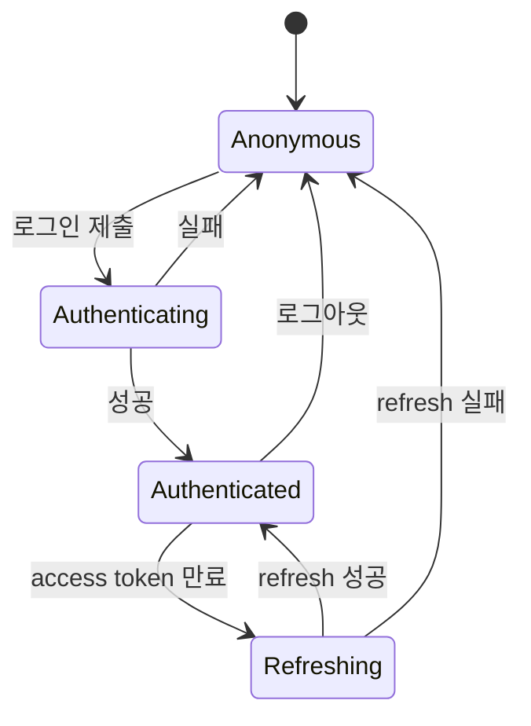

---

## 5. 여행 관리 기능 상세설계 목차

### 5.1 요구사항

- 사용자는 여러 개의 여행을 생성/조회/수정/삭제할 수 있다.
- 모든 하위 데이터는 특정 Trip에 종속된다.
- 현행 localStorage trip document는 최초 로그인 후 서버 저장 구조로 이관할 수 있어야 한다.

### 5.2 화면

| 화면 | 경로 | 설명 |
|---|---|---|
| 여행 목록 | `/trips` | 내가 소유/참여한 여행 목록 |
| 여행 생성 | `/trips/new` | 제목, 기간, 시간대, 설명 입력 |
| 여행 상세 Shell | `/trips/:tripId` | 탭/사이드바/지도/인스펙터 공통 레이아웃 |
| 여행 설정 | `/trips/:tripId/settings` | 기본정보, 멤버, 삭제/보관 |

### 5.3 핵심 모델

```text
Trip
- id: number
- ownerUserId: number
- title: string
- description: string | null
- startDate: date
- endDate: date
- timezone: string
- status: draft | active | completed | archived
- createdAt: datetime
- updatedAt: datetime
- deletedAt: datetime | null

TripMember
- id: number
- tripId: number
- userId: number | null
- displayName: string
- role: owner | editor | viewer
- memberType: user | guest | family
```

### 5.4 Trip 상태 전이

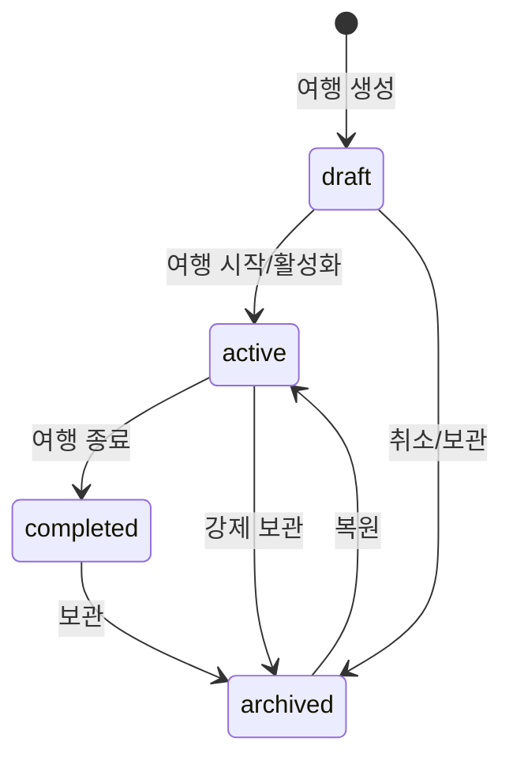

### 5.5 Trip aggregate 조회 DTO

```text
TripDocumentDTO
- trip: Trip
- members: TripMember[]
- places: Place[]
- meals: Meal[]
- shoppingLists: ShoppingList[]
- photos: Photo[]
- movementLogs: MovementLog[]
- itineraryItems: ItineraryItem[]
- routes: Route[]
```

---

## 6. 장소 기능 상세설계 목차

### 6.1 요구사항

- 여행 안에 방문한 곳, 식사한 곳, 숙소, 쇼핑 장소를 저장한다.
- 장소는 지도 좌표와 주소를 가진다.
- Open Map 검색 결과를 사용해 장소를 생성할 수 있다.

### 6.2 화면

| 화면 | 경로 | 설명 |
|---|---|---|
| 장소 목록 | `/trips/:tripId/places` | 카테고리별 장소 조회 |
| 장소 상세 | `/trips/:tripId/places/:placeId` | 주소, 좌표, 사진, 연결 일정 |
| 장소 생성/수정 | 모달 또는 패널 | 검색/수동 입력 지원 |

### 6.3 모델

```text
Place
- id: number
- tripId: number
- name: string
- category: stay | visit | meal | shopping | logistics | custom
- address: string | null
- latitude: decimal(10,7) | null
- longitude: decimal(10,7) | null
- externalProvider: osm | nominatim | manual | null
- externalPlaceId: string | null
- memo: string | null
- visitedAt: datetime | null
```

### 6.4 장소 생성 흐름

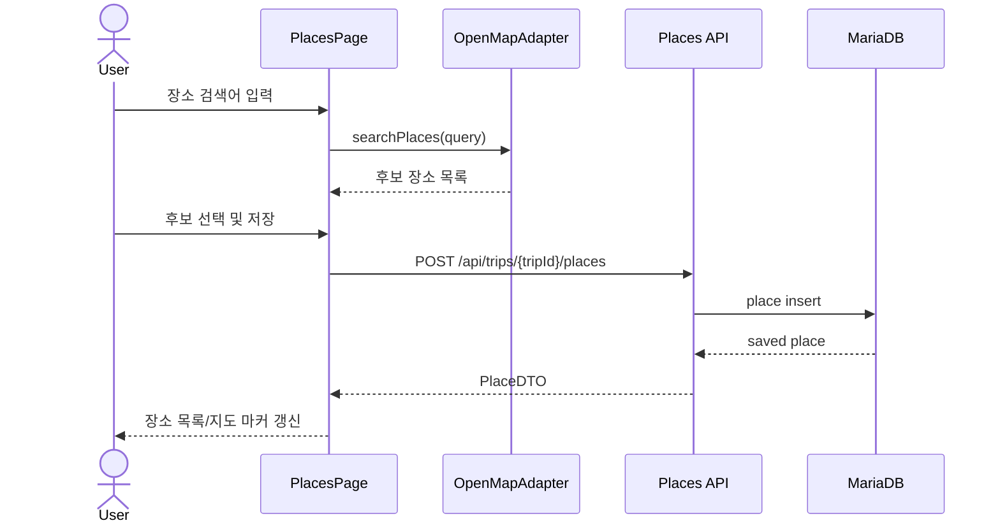

---

## 7. 식사 기능 상세설계 목차

### 7.1 요구사항

- 여행 안에 식사 계획을 등록한다.
- 식사는 장소와 선택적으로 연결된다.
- 식사 시간, 식사 유형, 예약 상태, 담당자, 메모를 관리한다.

### 7.2 모델

```text
Meal
- id: number
- tripId: number
- placeId: number | null
- title: string
- mealType: breakfast | lunch | dinner | snack | cafe | custom
- plannedAt: datetime
- reservationStatus: none | needed | booked | cancelled
- assignedMemberId: number | null
- memo: string | null
```

### 7.3 식사 예약 상태 전이

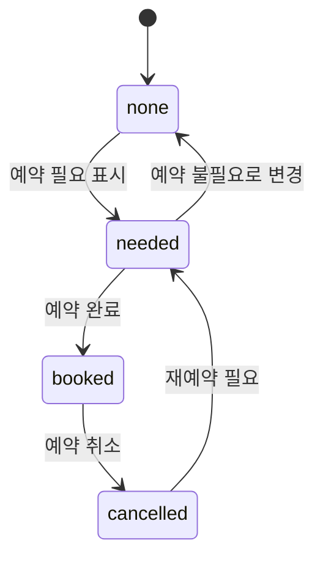

---

## 8. 쇼핑리스트 기능 상세설계 목차

### 8.1 요구사항

- 여행별 쇼핑리스트를 여러 개 만들 수 있다.
- 각 항목은 수량, 단위, 담당자, 구매 상태를 가진다.
- 장보기 장소와 선택적으로 연결한다.

### 8.2 모델

```text
ShoppingList
- id: number
- tripId: number
- title: string
- placeId: number | null
- dueAt: datetime | null
- memo: string | null

ShoppingItem
- id: number
- shoppingListId: number
- name: string
- quantity: number
- unit: string | null
- status: todo | assigned | bought | cancelled
- assignedMemberId: number | null
- boughtAt: datetime | null
- memo: string | null
```

### 8.3 쇼핑 항목 상태 전이

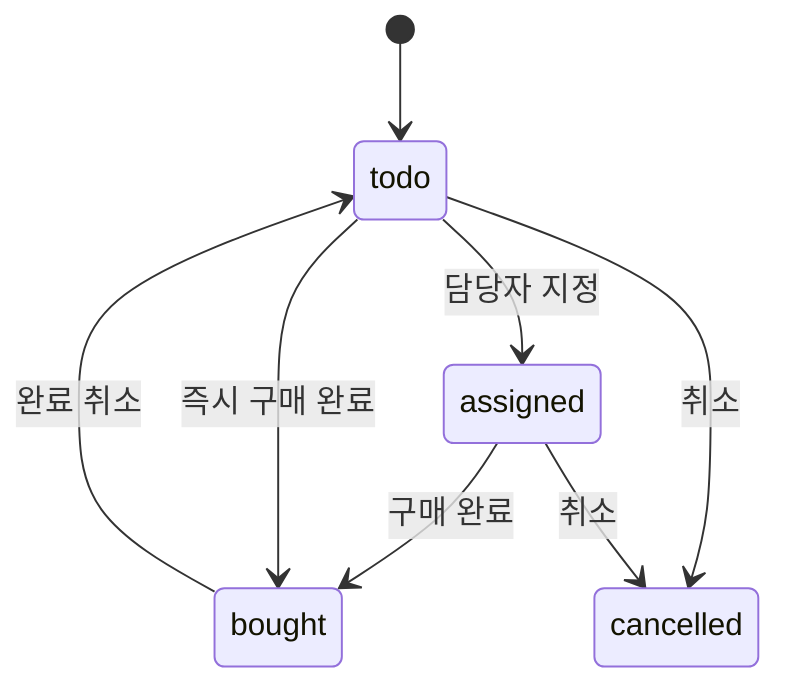

---

## 9. 사진 기능 상세설계 목차

### 9.1 요구사항

- 여행 단위 사진을 저장한다.
- 사진은 특정 장소, 식사, 이동로그에 태깅할 수 있다.
- DB에는 파일 메타데이터만 저장하고 실제 파일은 파일 서버/Object Storage를 가정한다.

### 9.2 모델

```text
Photo
- id: number
- tripId: number
- uploaderUserId: number
- placeId: number | null
- mealId: number | null
- movementLogId: number | null
- originalFileName: string
- contentType: string
- fileSizeBytes: number
- storageUrl: string
- thumbnailUrl: string | null
- takenAt: datetime | null
- latitude: decimal(10,7) | null
- longitude: decimal(10,7) | null
- caption: string | null
```

### 9.3 업로드 상태 흐름

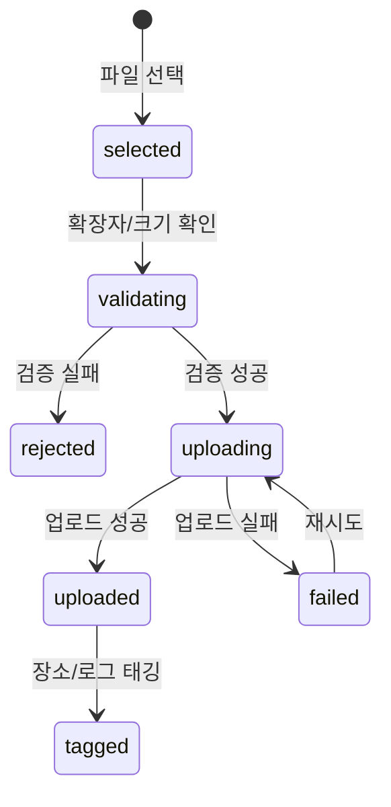

---

## 10. 이동로그 기능 상세설계 목차

### 10.1 요구사항

- 여행 안의 이동을 계획 또는 실제 기록으로 저장한다.
- 출발지/도착지는 Place와 연결한다.
- 지도 경로 API 결과를 Route로 캐시한다.
- 이동로그는 타임라인 및 지도 재생에 사용된다.

### 10.2 모델

```text
MovementLog
- id: number
- tripId: number
- type: planned | actual | manual | imported
- fromPlaceId: number | null
- toPlaceId: number | null
- startedAt: datetime | null
- endedAt: datetime | null
- distanceMeters: number | null
- durationSeconds: number | null
- routeId: number | null
- memo: string | null

Route
- id: number
- provider: osrm | ors | graphhopper | manual
- profile: car | walk | bike
- fromLatitude: decimal(10,7)
- fromLongitude: decimal(10,7)
- toLatitude: decimal(10,7)
- toLongitude: decimal(10,7)
- geometry: json
- distanceMeters: number
- durationSeconds: number
- fetchedAt: datetime
```

### 10.3 이동로그 생성 흐름

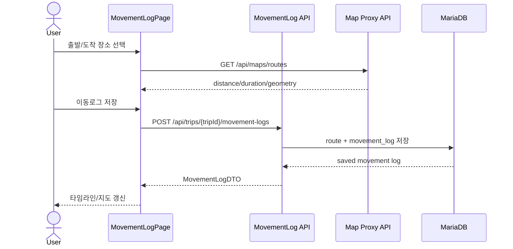

---

## 11. Open Map 전환 기능 상세설계 목차

### 11.1 요구사항

- `@googlemaps/js-api-loader` 의존 제거
- Google Maps 전용 객체(`google.maps.Map`, `Marker`, `Polyline`, geometry spherical 등) 제거
- 지도 렌더링, 마커, 경로, 장소검색, 길찾기를 Open Map 계열 API로 대체
- 기존 도메인 데이터의 `coordinates`, `route.path`, `externalUrl` 의미를 유지하되 provider-neutral DTO로 변환

### 11.2 지도 어댑터 인터페이스

```text
MapProviderAdapter
- initialize(container, options): MapInstance
- setView(center, zoom): void
- addMarker(marker: MapMarker): MarkerHandle
- drawPolyline(polyline: MapPolyline): PolylineHandle
- fitBounds(bounds): void
- searchPlaces(query, near?): Promise<PlaceSearchResult[]>
- reverseGeocode(lat, lng): Promise<AddressResult>
- getRoute(request): Promise<RouteResult>
- destroy(): void
```

### 11.3 Provider-neutral DTO

```text
LatLng
- lat: number
- lng: number

MapMarker
- id: string
- position: LatLng
- title: string
- category: string
- color: string

RouteResult
- provider: string
- profile: car | walk | bike
- geometry: LatLng[]
- distanceMeters: number
- durationSeconds: number
- source: cached | live | manual

PlaceSearchResult
- provider: string
- providerPlaceId: string
- name: string
- address: string
- position: LatLng
- category: string | null
```

### 11.4 Google 제거 대상 매핑

| 현행 Google 의존 | 대체 설계 |
|---|---|
| `@googlemaps/js-api-loader` | Leaflet/MapLibre 초기화 모듈 |
| `google.maps.Map` | `MapProviderAdapter.initialize` 반환 instance |
| `google.maps.Marker`/AdvancedMarker | adapter의 `addMarker` |
| `google.maps.Polyline` | adapter의 `drawPolyline` |
| `google.maps.geometry.spherical.computeLength` | route API distance 또는 turf.js length |
| Google Directions/Routes | OSRM/ORS/GraphHopper route API |
| Google Places search | Nominatim/Pelias search API |
| Google Maps URL | OSM URL builder |

### 11.5 지도 클래스 관계

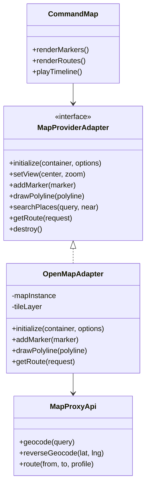

---

## 12. localStorage to MariaDB 마이그레이션 설계

### 12.1 대상

현행 localStorage key:

- `trip-command-center/v4-public`
- `trip-command-center/viewer/v4-public`
- legacy keys: v1/v2/v3

### 12.2 전략

1. 로그인 후 localStorage에 기존 trip document가 있는지 확인한다.
2. 서버에 동일한 imported trip이 없는지 `sourceClientId` 또는 checksum으로 확인한다.
3. 사용자가 가져오기를 승인하면 `POST /api/trips/import-local-document` 호출.
4. 서버는 document collections를 MariaDB 정규화 테이블에 매핑한다.
5. 성공 후 localStorage에는 `migration.completedAt`, `serverTripId`만 남긴다.

### 12.3 마이그레이션 흐름

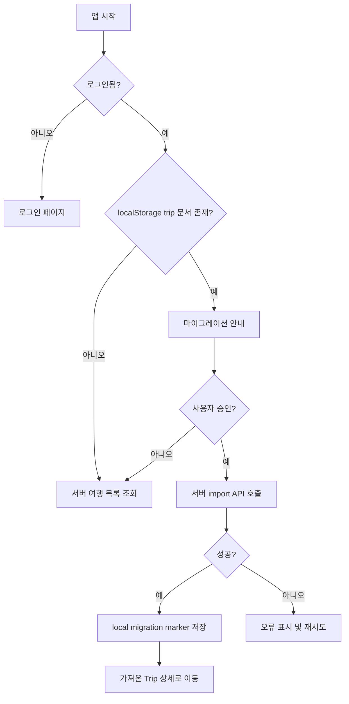

---

## 13. 권한 설계

| 역할 | 여행 조회 | 여행 수정 | 멤버 관리 | 사진 업로드 | 삭제 |
|---|---:|---:|---:|---:|---:|
| owner | O | O | O | O | O |
| editor | O | O | X | O | X |
| viewer | O | X | X | X | X |
| guest | 제한 | X | X | 선택 | X |

권한 체크 위치:

- 프론트엔드: 버튼/메뉴 노출 제어
- 백엔드: 모든 mutation API에서 최종 권한 검증
- DB: `trip_members` 기준으로 접근 범위 필터링

---

## 14. 기능 구현 우선순위 제안

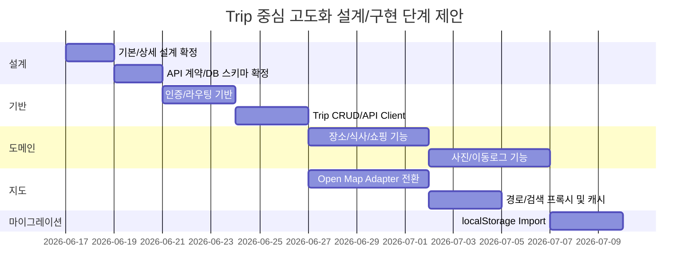

---

## 15. 상세설계서 파일 구성 제안

프로젝트 `plan/` 폴더 하위에 아래 문서로 분리한다.

```text
plan/
  00-basic-design.md                  # 전체 기본 설계
  01-feature-breakdown.md             # 기능별 상세설계 개요
  02-auth-design.md                   # 인증 상세설계
  03-trip-domain-design.md            # Trip aggregate/DB/API 상세설계
  04-open-map-migration-design.md     # Google Maps 제거 및 Open Map 전환 설계
  05-place-meal-shopping-design.md    # 장소/식사/쇼핑 상세설계
  06-photo-movement-log-design.md     # 사진/이동로그 상세설계
  07-local-storage-migration-design.md# localStorage→MariaDB 마이그레이션
```

---

## 16. 기능별 Mermaid 다이어그램 체크리스트

| 기능 | 필수 다이어그램 | 선택 다이어그램 |
|---|---|---|
| 인증 | sequenceDiagram, stateDiagram-v2 | flowchart |
| 여행 관리 | erDiagram, stateDiagram-v2, sequenceDiagram | journey |
| 장소 | sequenceDiagram, flowchart | classDiagram |
| 식사 | stateDiagram-v2, sequenceDiagram | erDiagram |
| 쇼핑리스트 | stateDiagram-v2, erDiagram | flowchart |
| 사진 | stateDiagram-v2, sequenceDiagram | flowchart |
| 이동로그 | sequenceDiagram, classDiagram | stateDiagram-v2 |
| Open Map 전환 | classDiagram, flowchart, sequenceDiagram | C4 스타일 flowchart |
| 마이그레이션 | flowchart, sequenceDiagram | gantt |

---

## 17. 설계 완료 기준

- 모든 기능이 Trip ID를 기준으로 접근/저장되는지 확인한다.
- Google Maps 전용 타입이 상세설계 DTO에 남아있지 않아야 한다.
- MariaDB ERD에서 FK, 인덱스, 삭제 정책이 정의되어야 한다.
- 인증이 필요한 API와 공개 가능한 API가 구분되어야 한다.
- localStorage 데이터 가져오기 정책과 실패 시 복구 방법이 정의되어야 한다.
- Mermaid 다이어그램이 GitHub/Markdown 렌더러에서 해석 가능한 문법이어야 한다.
