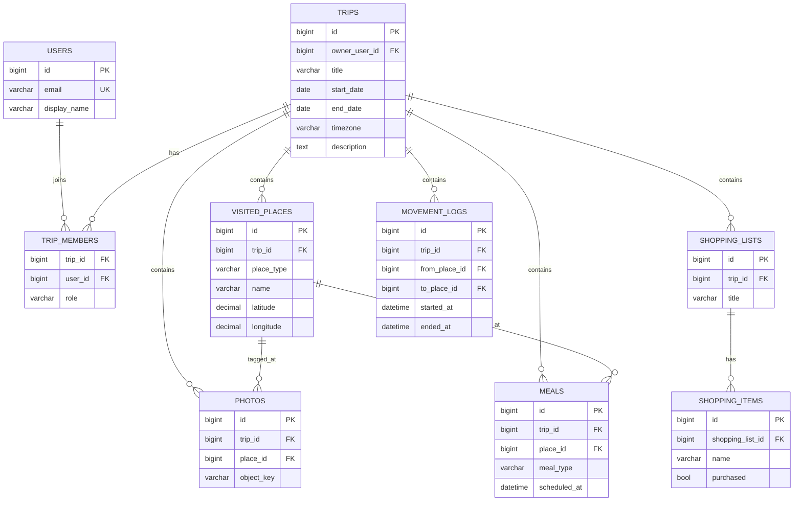
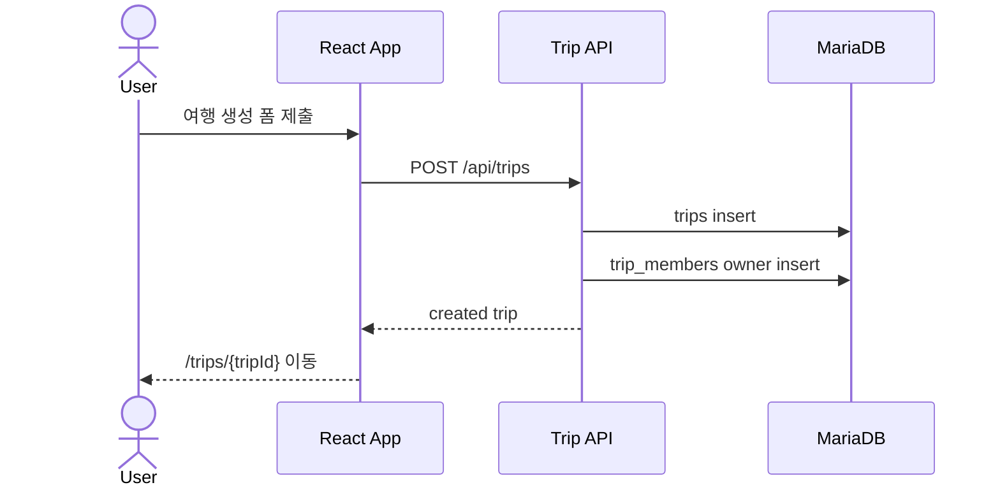

# 여행 도메인 상세설계서

## 1. 목적

`여행(Trip)`을 최상위 aggregate로 정의하고, 방문 장소, 식사, 쇼핑리스트, 사진, 이동로그 등 모든 여행 데이터를 여행 하위에 저장한다.

## 2. 핵심 규칙

- 모든 여행 데이터는 `trip_id`를 가진다.
- 여행 소유자 또는 멤버만 여행 데이터를 읽고 쓸 수 있다.
- 삭제는 우선 soft delete를 기본으로 한다.
- 현행 `tripModel.js`의 local document는 서버 Trip DTO로 단계적으로 치환한다.

## 3. 도메인 관계



## 4. Trip API

| Method | Path | 설명 |
|---|---|---|
| GET | `/api/trips` | 내 여행 목록 |
| POST | `/api/trips` | 여행 생성 |
| GET | `/api/trips/{tripId}` | 여행 상세 aggregate 조회 |
| PATCH | `/api/trips/{tripId}` | 여행 기본정보 수정 |
| DELETE | `/api/trips/{tripId}` | 여행 soft delete |
| GET | `/api/trips/{tripId}/summary` | 대시보드 요약 |

## 5. 상세 조회 DTO 구조

```json
{
  "trip": {},
  "members": [],
  "places": [],
  "meals": [],
  "shoppingLists": [],
  "photos": [],
  "movementLogs": []
}
```

## 6. 여행 생성 흐름



## 7. 검증 기준

- 여행 상세 응답에 요구 데이터가 같은 `trip_id` 기준으로 포함된다.
- 다른 여행의 장소/사진/이동로그가 섞이지 않는다.
- 멤버가 아닌 사용자는 403을 받는다.
