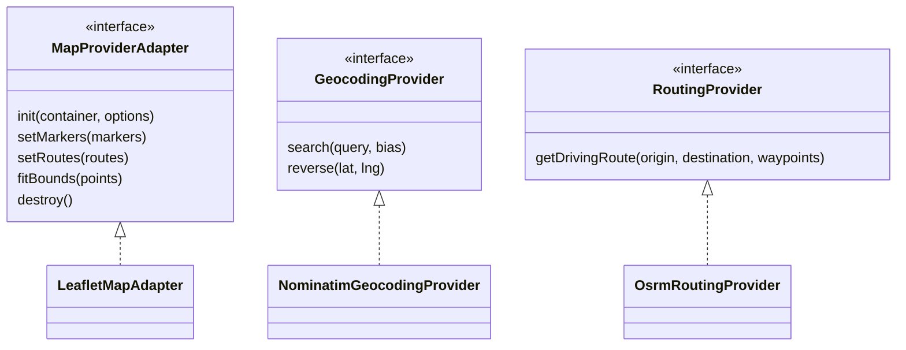
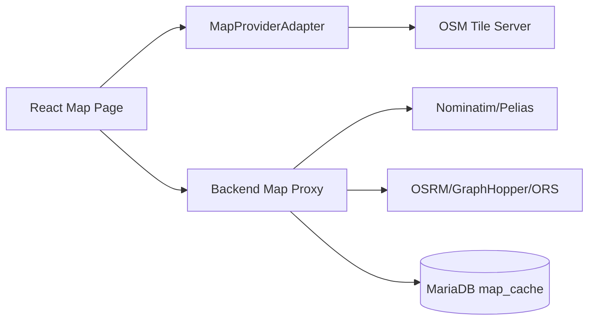
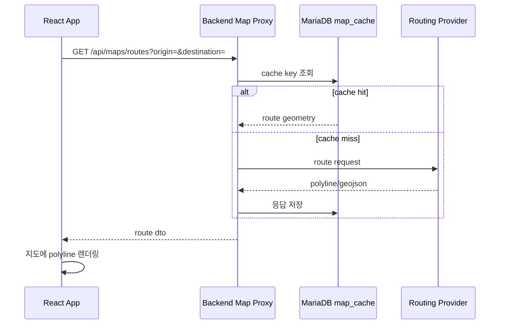

# Open Map 전환 상세설계서

## 1. 목적

Google Maps JS API 의존을 제거하고 OpenStreetMap 계열의 지도 렌더링, 지오코딩, 경로 탐색으로 전환한다.

## 2. 권장 구성

| 기능 | 후보 | 비고 |
|---|---|---|
| 지도 렌더링 | Leaflet 또는 MapLibre GL JS | 단순 마커/라인 중심이면 Leaflet 우선 |
| 타일 | OSM-compatible tile server | 운영 트래픽은 자체/유료 타일 권장 |
| 장소 검색 | Nominatim 또는 Pelias | 서버 프록시와 캐시 필수 |
| 경로 탐색 | OSRM, GraphHopper, OpenRouteService | API rate limit 고려 |
| 거리 계산 | turf.js 또는 haversine 유틸 | Google geometry 대체 |

## 3. Adapter 구조

## 4. 변경 대상

- `package.json`
  - 제거: `@googlemaps/js-api-loader`
  - 추가 후보: `leaflet`, `react-leaflet`, `@turf/turf`
- `src/CommandMap.jsx`
  - Google Maps 직접 호출 제거
  - `MapProviderAdapter` 호출로 치환
- `src/tripModel.js`
  - Google Maps 링크를 OSM 링크로 변경
- `.env.example`
  - `VITE_GOOGLE_MAPS_API_KEY` 제거
  - `VITE_MAP_TILE_URL`, `VITE_GEOCODING_API_BASE`, `VITE_ROUTING_API_BASE` 추가

## 5. 지도 데이터 흐름

## 6. 경로 조회 시퀀스

## 7. 리스크

- 공개 Nominatim/OSM tile은 운영 대량 트래픽에 부적합하다.
- Google Places 수준의 POI 품질을 기대하면 안 된다.
- Provider별 응답 포맷 차이를 Adapter/DTO로 격리해야 한다.
