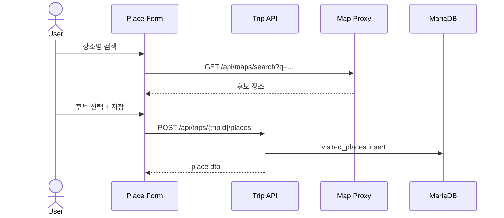
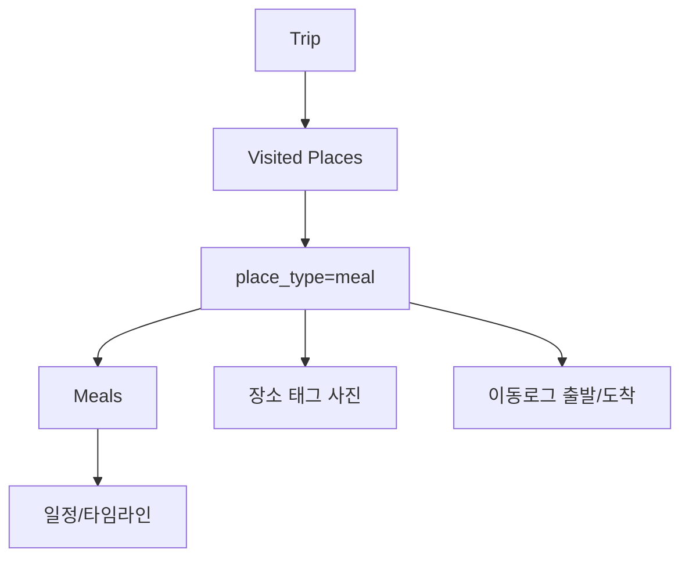

# 방문 장소/식사 장소 상세설계서

## 1. 목적

여행 안에서 방문한 장소와 식사한 장소를 저장하고, 지도/일정/사진/이동로그와 연결한다.

## 2. 장소 타입

| 타입 | 설명 |
|---|---|
| `visit` | 일반 방문지 |
| `meal` | 식사 장소 |
| `stay` | 숙소/거점 |
| `shopping` | 장보기/쇼핑 장소 |
| `transit_stop` | 휴게소/경유지 |

## 3. API

| Method | Path | 설명 |
|---|---|---|
| GET | `/api/trips/{tripId}/places` | 장소 목록 |
| POST | `/api/trips/{tripId}/places` | 장소 생성 |
| PATCH | `/api/trips/{tripId}/places/{placeId}` | 장소 수정 |
| DELETE | `/api/trips/{tripId}/places/{placeId}` | 장소 삭제 |
| GET | `/api/trips/{tripId}/meals` | 식사 목록 |
| POST | `/api/trips/{tripId}/meals` | 식사 일정 생성 |

## 4. MariaDB 테이블

```sql
CREATE TABLE visited_places (
  id BIGINT PRIMARY KEY AUTO_INCREMENT,
  trip_id BIGINT NOT NULL,
  place_type VARCHAR(30) NOT NULL,
  name VARCHAR(255) NOT NULL,
  address VARCHAR(500) NULL,
  latitude DECIMAL(10,7) NULL,
  longitude DECIMAL(10,7) NULL,
  external_provider VARCHAR(50) NULL,
  external_place_id VARCHAR(255) NULL,
  memo TEXT NULL,
  visited_at DATETIME NULL,
  created_at DATETIME NOT NULL DEFAULT CURRENT_TIMESTAMP,
  updated_at DATETIME NOT NULL DEFAULT CURRENT_TIMESTAMP ON UPDATE CURRENT_TIMESTAMP,
  INDEX idx_places_trip_type (trip_id, place_type),
  CONSTRAINT fk_places_trip FOREIGN KEY (trip_id) REFERENCES trips(id)
);

CREATE TABLE meals (
  id BIGINT PRIMARY KEY AUTO_INCREMENT,
  trip_id BIGINT NOT NULL,
  place_id BIGINT NULL,
  title VARCHAR(255) NOT NULL,
  meal_type VARCHAR(30) NOT NULL,
  scheduled_at DATETIME NULL,
  reservation_status VARCHAR(30) NOT NULL DEFAULT 'none',
  memo TEXT NULL,
  created_at DATETIME NOT NULL DEFAULT CURRENT_TIMESTAMP,
  CONSTRAINT fk_meals_trip FOREIGN KEY (trip_id) REFERENCES trips(id),
  CONSTRAINT fk_meals_place FOREIGN KEY (place_id) REFERENCES visited_places(id)
);
```

## 5. 장소 생성 흐름



## 6. 장소-식사 관계


