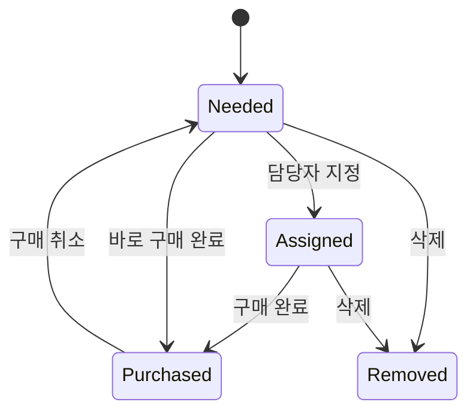
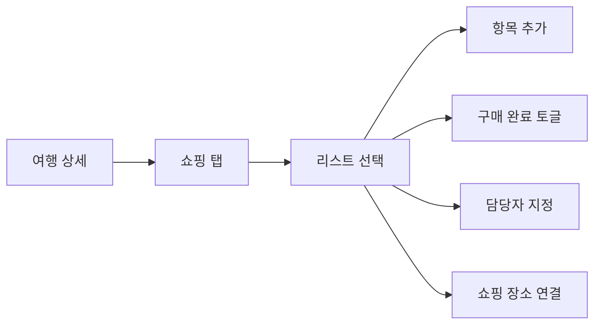

# 쇼핑리스트 상세설계서

## 1. 목적

여행별 쇼핑리스트와 구매 항목을 관리한다. 담당자, 수량, 구매 상태, 쇼핑 장소를 기록한다.

## 2. API

| Method | Path | 설명 |
|---|---|---|
| GET | `/api/trips/{tripId}/shopping-lists` | 리스트 조회 |
| POST | `/api/trips/{tripId}/shopping-lists` | 리스트 생성 |
| PATCH | `/api/trips/{tripId}/shopping-lists/{listId}` | 리스트 수정 |
| POST | `/api/trips/{tripId}/shopping-lists/{listId}/items` | 항목 추가 |
| PATCH | `/api/trips/{tripId}/shopping-items/{itemId}` | 항목 수정/구매완료 |
| DELETE | `/api/trips/{tripId}/shopping-items/{itemId}` | 항목 삭제 |

## 3. MariaDB 테이블

```sql
CREATE TABLE shopping_lists (
  id BIGINT PRIMARY KEY AUTO_INCREMENT,
  trip_id BIGINT NOT NULL,
  title VARCHAR(255) NOT NULL,
  place_id BIGINT NULL,
  created_by BIGINT NOT NULL,
  created_at DATETIME NOT NULL DEFAULT CURRENT_TIMESTAMP,
  CONSTRAINT fk_shopping_lists_trip FOREIGN KEY (trip_id) REFERENCES trips(id),
  CONSTRAINT fk_shopping_lists_place FOREIGN KEY (place_id) REFERENCES visited_places(id)
);

CREATE TABLE shopping_items (
  id BIGINT PRIMARY KEY AUTO_INCREMENT,
  shopping_list_id BIGINT NOT NULL,
  name VARCHAR(255) NOT NULL,
  quantity VARCHAR(100) NULL,
  assigned_user_id BIGINT NULL,
  purchased BOOLEAN NOT NULL DEFAULT FALSE,
  purchased_at DATETIME NULL,
  memo TEXT NULL,
  sort_order INT NOT NULL DEFAULT 0,
  CONSTRAINT fk_shopping_items_list FOREIGN KEY (shopping_list_id) REFERENCES shopping_lists(id)
);
```

## 4. 상태 흐름



## 5. 화면 흐름



## 6. 검증 기준

- 같은 여행의 멤버만 쇼핑 항목을 변경할 수 있다.
- 구매 완료 시 `purchased=true`, `purchased_at`이 함께 저장된다.
- 리스트 삭제 시 항목 처리 정책을 명확히 한다. 기본은 soft delete 권장.
