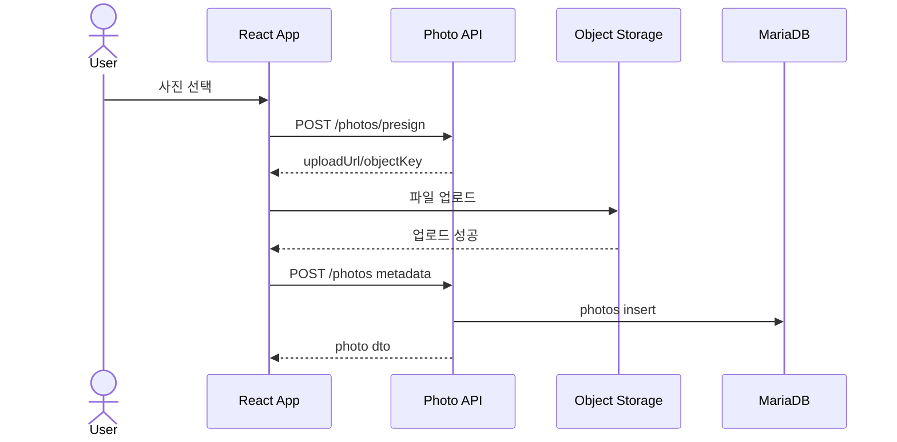
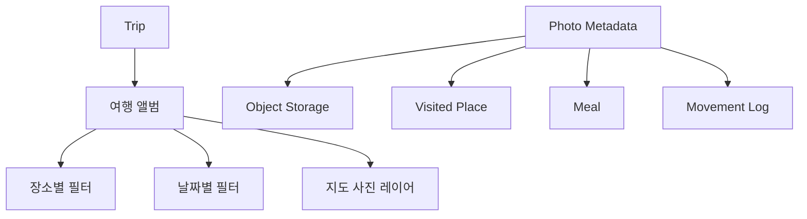

# 사진 기능 상세설계서

## 1. 목적

여행 사진을 업로드하고, 여행/장소/식사/이동로그와 연결해 앨범과 지도에서 조회한다.

## 2. 저장 전략

- MariaDB에는 메타데이터만 저장한다.
- 실제 파일은 로컬 파일 스토리지, S3 호환 스토리지, NAS 중 하나를 사용한다.
- 공개 URL을 DB에 직접 저장하기보다 `object_key`를 저장하고 API에서 접근 권한을 확인한다.

## 3. API

| Method | Path | 설명 |
|---|---|---|
| GET | `/api/trips/{tripId}/photos` | 사진 목록 |
| POST | `/api/trips/{tripId}/photos/presign` | 업로드 URL 발급 또는 업로드 세션 생성 |
| POST | `/api/trips/{tripId}/photos` | 사진 메타데이터 저장 |
| PATCH | `/api/trips/{tripId}/photos/{photoId}` | 태그/메모 수정 |
| DELETE | `/api/trips/{tripId}/photos/{photoId}` | 사진 삭제 |

## 4. MariaDB 테이블

```sql
CREATE TABLE photos (
  id BIGINT PRIMARY KEY AUTO_INCREMENT,
  trip_id BIGINT NOT NULL,
  place_id BIGINT NULL,
  meal_id BIGINT NULL,
  movement_log_id BIGINT NULL,
  uploaded_by BIGINT NOT NULL,
  object_key VARCHAR(500) NOT NULL,
  thumbnail_object_key VARCHAR(500) NULL,
  original_filename VARCHAR(255) NULL,
  content_type VARCHAR(100) NOT NULL,
  taken_at DATETIME NULL,
  latitude DECIMAL(10,7) NULL,
  longitude DECIMAL(10,7) NULL,
  memo TEXT NULL,
  created_at DATETIME NOT NULL DEFAULT CURRENT_TIMESTAMP,
  INDEX idx_photos_trip_created (trip_id, created_at),
  CONSTRAINT fk_photos_trip FOREIGN KEY (trip_id) REFERENCES trips(id),
  CONSTRAINT fk_photos_place FOREIGN KEY (place_id) REFERENCES visited_places(id)
);
```

## 5. 업로드 시퀀스



## 6. 사진 조회 구조



## 7. 검증 기준

- 사진 목록은 여행 권한 확인 후 반환한다.
- 삭제 시 DB 메타데이터와 실제 object 삭제의 실패 보상 처리를 설계한다.
- EXIF 위치정보는 개인정보이므로 노출 여부를 사용자가 제어할 수 있어야 한다.
