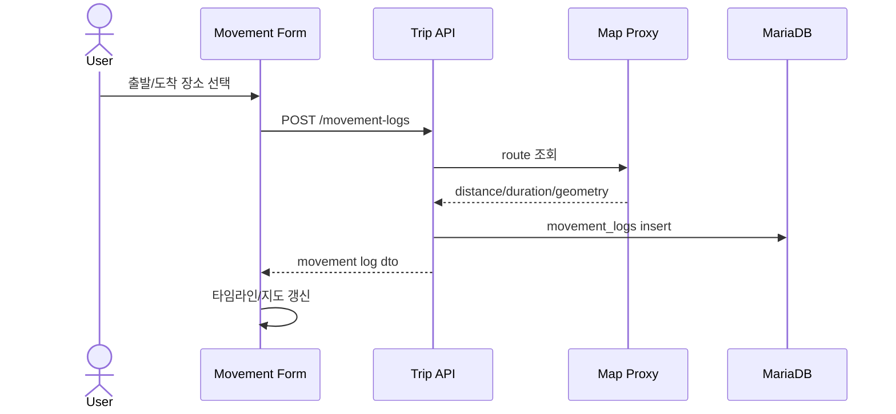
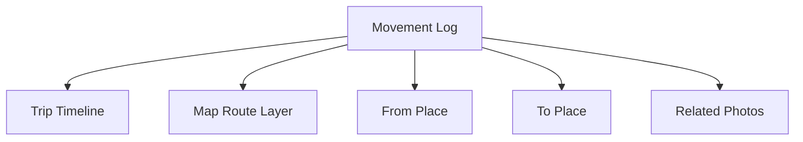

# 이동로그 상세설계서

## 1. 목적

여행 중 계획 이동과 실제 이동 기록을 저장하고 지도 경로와 타임라인에서 조회한다.

## 2. 로그 타입

| 타입 | 설명 |
|---|---|
| `planned` | 계획된 이동 |
| `actual` | 실제 기록된 이동 |
| `manual` | 사용자가 수동 입력한 이동 |

## 3. API

| Method | Path | 설명 |
|---|---|---|
| GET | `/api/trips/{tripId}/movement-logs` | 이동로그 목록 |
| POST | `/api/trips/{tripId}/movement-logs` | 이동로그 생성 |
| PATCH | `/api/trips/{tripId}/movement-logs/{logId}` | 이동로그 수정 |
| DELETE | `/api/trips/{tripId}/movement-logs/{logId}` | 이동로그 삭제 |
| POST | `/api/trips/{tripId}/movement-logs/{logId}/route-refresh` | 지도 provider 기준 경로 갱신 |

## 4. MariaDB 테이블

```sql
CREATE TABLE movement_logs (
  id BIGINT PRIMARY KEY AUTO_INCREMENT,
  trip_id BIGINT NOT NULL,
  log_type VARCHAR(30) NOT NULL,
  from_place_id BIGINT NULL,
  to_place_id BIGINT NULL,
  title VARCHAR(255) NOT NULL,
  started_at DATETIME NULL,
  ended_at DATETIME NULL,
  distance_meters INT NULL,
  duration_seconds INT NULL,
  route_provider VARCHAR(50) NULL,
  route_geometry JSON NULL,
  memo TEXT NULL,
  created_at DATETIME NOT NULL DEFAULT CURRENT_TIMESTAMP,
  INDEX idx_movement_trip_time (trip_id, started_at),
  CONSTRAINT fk_movement_trip FOREIGN KEY (trip_id) REFERENCES trips(id),
  CONSTRAINT fk_movement_from_place FOREIGN KEY (from_place_id) REFERENCES visited_places(id),
  CONSTRAINT fk_movement_to_place FOREIGN KEY (to_place_id) REFERENCES visited_places(id)
);
```

## 5. 이동로그 생성 흐름



## 6. 타임라인/지도 관계



## 7. 검증 기준

- 이동로그의 출발/도착 장소는 같은 `trip_id`에 속해야 한다.
- route provider 실패 시 직선 fallback 또는 수동 geometry를 허용한다.
- 지도 API 응답은 캐싱해 반복 호출을 줄인다.
