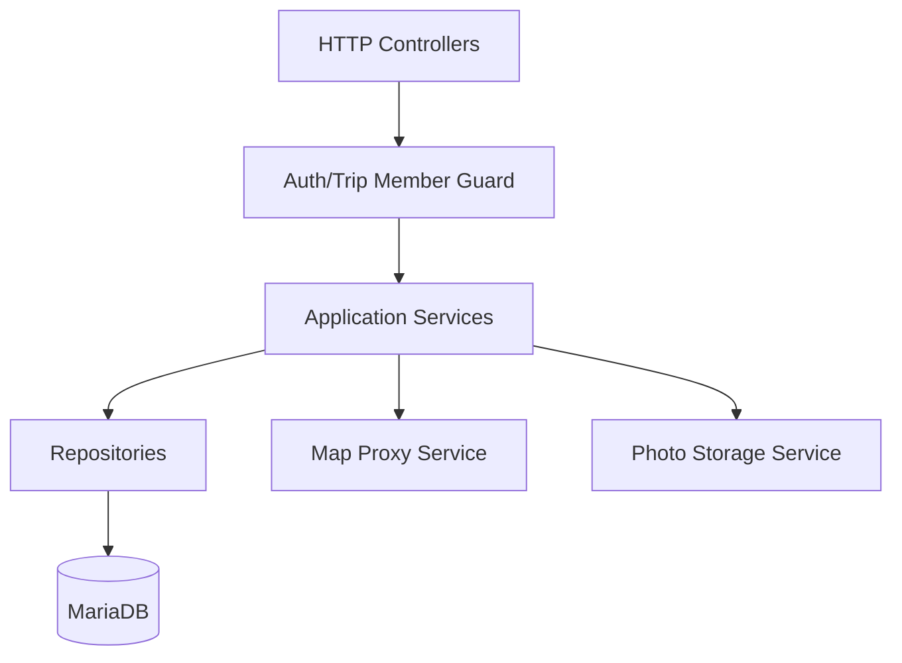
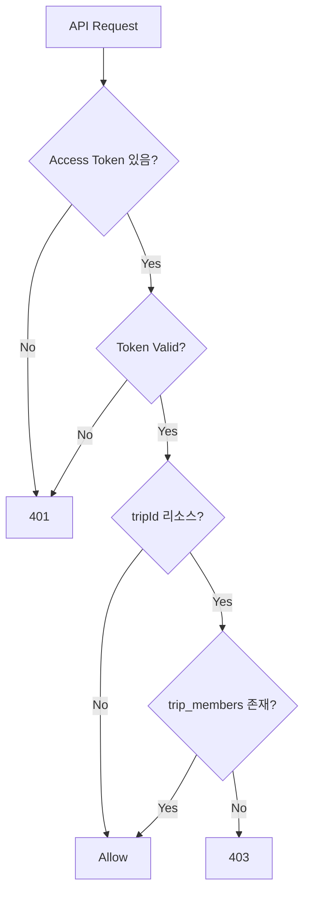
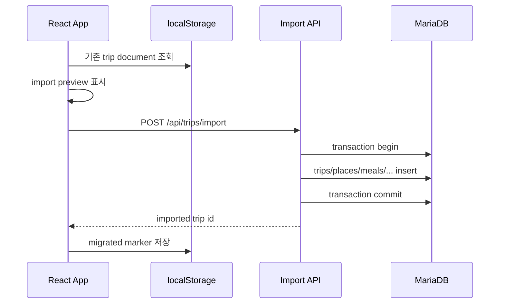

# MariaDB/API 상세설계서

## 1. 목적

React SPA 뒤에 백엔드 API와 MariaDB를 추가한다는 가정으로 데이터 영속화, 권한, 마이그레이션 기준을 정의한다.

## 2. 백엔드 레이어



## 3. 공통 API 규칙

- 인증: `Authorization: Bearer <access-token>`
- 날짜/시간: ISO-8601 UTC 저장, 화면에서는 여행 timezone으로 표시
- 오류 응답:

```json
{
  "error": {
    "code": "TRIP_NOT_FOUND",
    "message": "Trip not found",
    "details": {}
  }
}
```

## 4. 핵심 인덱스

```sql
CREATE INDEX idx_trips_owner ON trips(owner_user_id, created_at);
CREATE INDEX idx_trip_members_user ON trip_members(user_id, trip_id);
CREATE INDEX idx_places_trip_type ON visited_places(trip_id, place_type);
CREATE INDEX idx_meals_trip_time ON meals(trip_id, scheduled_at);
CREATE INDEX idx_photos_trip_created ON photos(trip_id, created_at);
CREATE INDEX idx_movement_trip_time ON movement_logs(trip_id, started_at);
```

## 5. 권한 처리



## 6. localStorage 마이그레이션

| 단계 | 설명 |
|---|---|
| 1 | 기존 `TRIP_DOCUMENT_STORAGE_KEY`를 읽어 마이그레이션 후보 표시 |
| 2 | 사용자가 가져오기 선택 |
| 3 | client document를 server DTO로 변환 |
| 4 | `/api/trips/import` 호출 |
| 5 | 성공 후 localStorage key를 migrated marker로 변경 |



## 7. 검증 기준

- import는 transaction으로 처리되어 중간 실패 시 rollback된다.
- 모든 trip 하위 테이블은 `trip_id` 인덱스를 가진다.
- 권한 검사는 controller가 아니라 guard/service 레이어에서 공통화한다.
